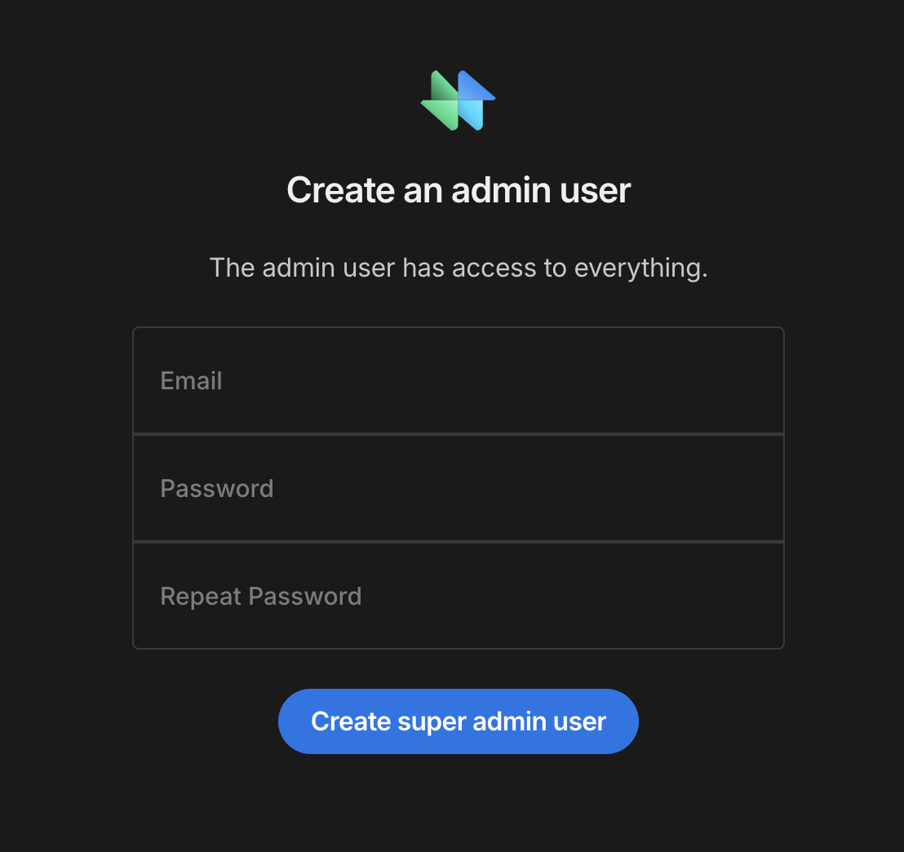

    

<h1 align="center">
  SuperToolMake
</h1>

<h3 align="center">
  A light weight fork of <a href="https://github.com/Budibase/budibase">Budibase</a>
</h3>

  SuperToolMake is an open-source low-code platform that saves you time building forms, portals, and approval apps, securely.

  <ul>
    ✔️ Includes the app builder for client apps
     ✖️ Excludes the pro module
     ✖️ Excludes the internal DB
     ✖️ Excludes automations
     ✖️ Excludes plugins
     ✖️ Excludes user groups
  </ul>

<h3>
  Local development
</h3>

  To run locally, you will need to have <b>docker</b> installed.

If you are not using _Docker Desktop_, you can use [Colima](https://github.com/abiosoft/colima).
 Run `colima start` to spin up the docker runtime.

Also ensure your IDE has permissions for mounting the volumes defined in <a href="/hosting/docker-compose.dev.yaml">docker-compose.dev.yaml</a>.
 For example, in macOS I had to do this via `Privacy & Security > Files & Folders`

<h4>Starting</h4>

`yarn` - installs the dependencies
 `yarn dev` - runs SuperToolMake locally

You will know yarn dev has worked correctly when there are no build errors of course, but also you will see the following containers running:

- budi-nginx-dev
- budi-couchdb3-dev
- budi-redis-dev
- budi-minio-dev

Once running, visit [localhost:10000/builder](http://localhost:10000/builder)

You should be prompted to create a super admin:

