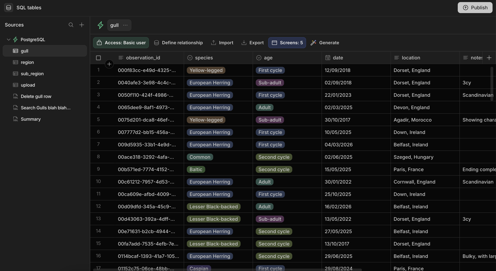
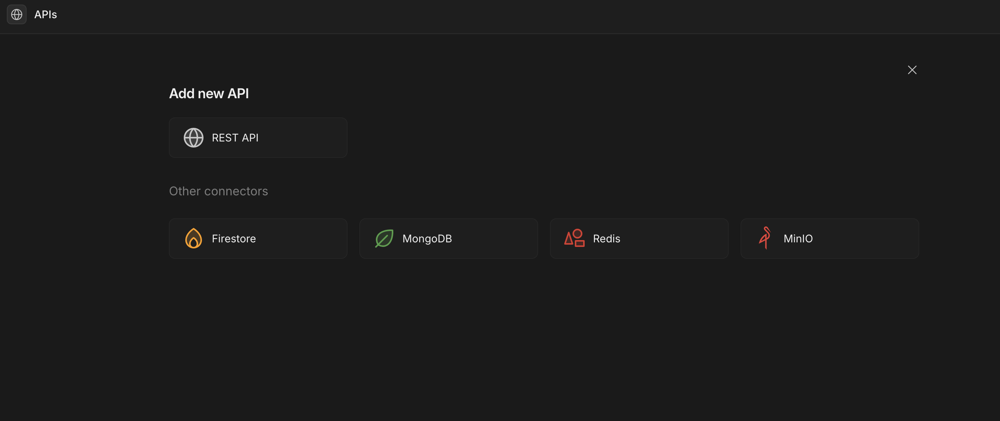
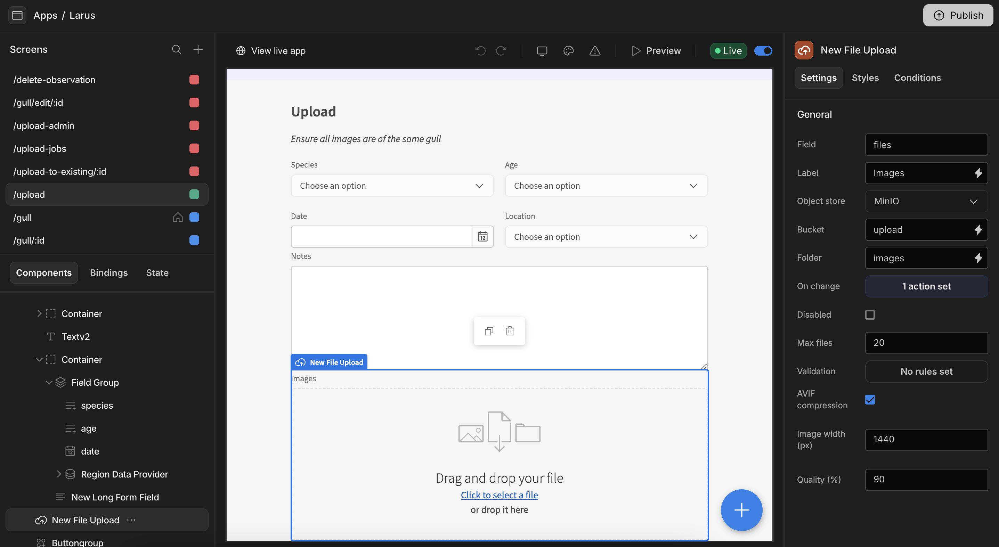
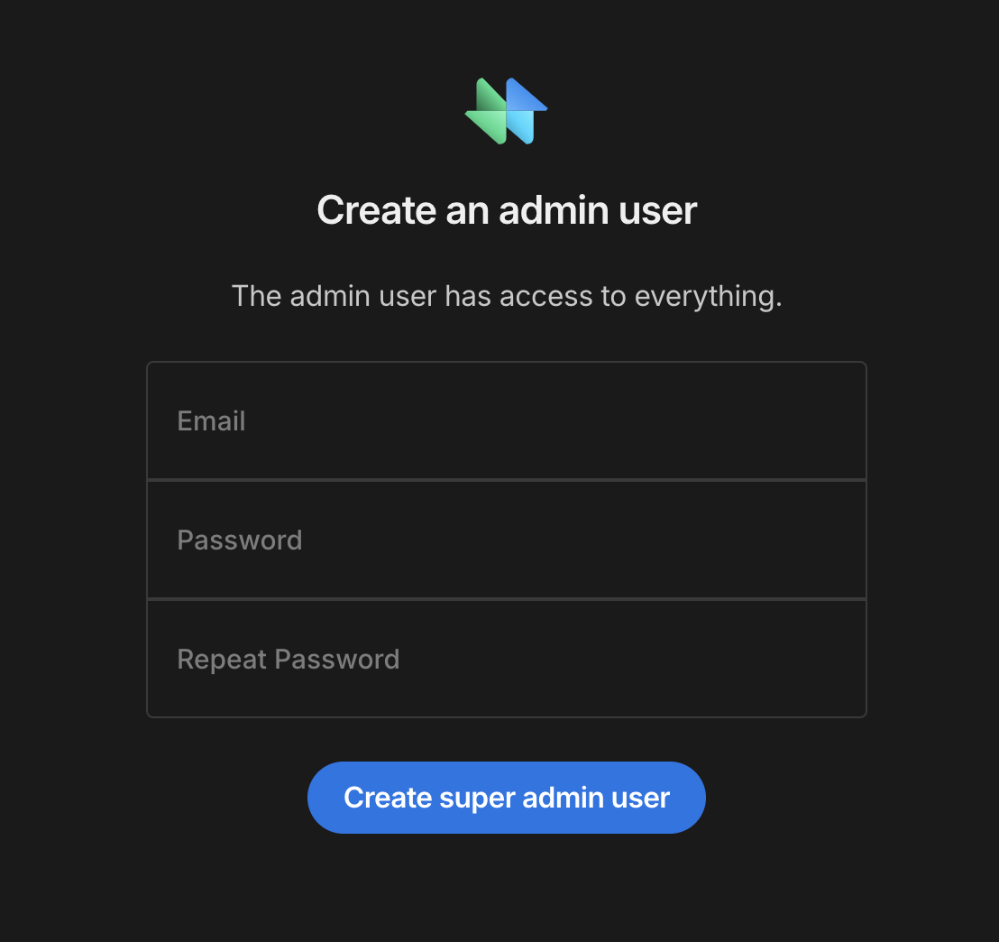

<div align="center">
    
</div>
<h1 align="center">
  SuperToolMake
</h1>

<h3 align="center">
  A lightweight fork of <a href="https://github.com/Budibase/budibase">Budibase</a>
</h3>
<p align="center">
  SuperToolMake is an open source low-code platform for quickly building forms and web apps, with built-in RBAC.
</p>

---

<h3>
  Connect your SQL tables
</h3>


Visualise your data tables, write SQL queries, and control data access to your end-users.

*PostgreSQL*, *MySQL* and *SQL Server* supported.

---

<h3>
  Connect to APIs
</h3>


Query non-SQL datasources, and make requests to external REST APIs.

---

<h3>
  App and Form builder
</h3>


Quickly build end-user forms, with the flexibility to add more advanced features if needed.

Integrates with any of your SQL tables or APIs, including controlled access with customizable RBAC.  

---

<h3>
  Why SuperToolMake?
</h3>
Other low-code platforms such as Appsmith and Tooljet recommend a minimum of 8GB of RAM when self-hosting. 

Budibase is better, but still recommends 4GB. 

SuperToolMake considers a lightweight and modular approach, focusing on the core app builder and data interface experience, with the option to connect to external workflow systems as needed.

**SuperToolMake has a total memory footprint under 0.5GB, and comfortably runs on a 1GB box.**

Currently I am running an app on *Scaleway Stardust*, which costs ~ €2/month: <a href="https://app.gullinfo.org/larus/app" target=_blank>https://app.gullinfo.org/app/larus</a>

I am also using [Supabase](https://supabase.com/) as my Postgres provider.

---

<h3>
  Running via Docker
</h3>
<p>
  A single image container is provided under <a href="https://github.com/SuperToolMake/supertoolmake/pkgs/container/supertoolmake">Packages</a>. 
  <br />Pull down the latest image.

If you are not using _Docker Desktop_, you can use [Colima](https://github.com/abiosoft/colima).
<br />Run `colima start` to spin up the docker runtime.

Run the container with the command:

```
docker run -d -t \
  --name=supertoolmake \
  -p 10000:80 \
  -v /local/path/data:/data \
  -v /local/path/data:/opt/couchdb/data \
  --restart unless-stopped \
  ghcr.io/supertoolmake/supertoolmake:latest
```

</p>

### Running via Docker Swarm

For production deployments requiring high availability and zero-downtime updates. This setup utilizes Swarm's built-in Routing Mesh to manage traffic and rolling updates automatically.

#### Prerequisites
Ensure Docker Engine is installed and Swarm mode is initialized on your host. You can initialize a single-node swarm (which you can expand later) by running `docker swarm init`.

#### Creating the service
Instead of docker run, use docker service create. Note that named volumes are used here for persistent data; ensure the volume my-vol exists or let Docker create it automatically. The following command sets up the service with the necessary port mapping and volume mounts:

```
docker service create --name supertoolmake --replicas 1 --publish 10000:80 --mount type=volume,source=my-vol,target=/data --mount type=volume,source=my-vol,target=/opt/couchdb/data --update-delay 10s ghcr.io/supertoolmake/supertoolmake:latest
```

#### Performing rolling updates
To update to a new version without downtime, simply run:

```
docker service update --image ghcr.io/supertoolmake/supertoolmake:latest supertoolmake --update-delay 45s
```

Swarm will automatically start the new container, verify it is healthy, and then stop the old one.

#### Managing environment variables
To pass environment variables, use the --env flag during creation (e.g., --env MY_VAR=value). To update environment variables later, you must re-run `docker service update --env ...`, which triggers a rolling restart of the service.

---

<h3>
  Local development
</h3>
<p>
  Ensure your IDE has permissions for mounting the volumes defined in <a href="/hosting/docker-compose.dev.yaml">docker-compose.dev.yaml</a>.
<br />For example, in macOS I had to do this via `Privacy & Security > Files & Folders`

</p>

<h4>Starting</h4>

`yarn` - installs the dependencies
<br />`yarn dev` - runs SuperToolMake locally

You will know yarn dev has worked correctly when there are no build errors of course, but also you will see the following containers running:

- super-tool-nginx-dev
- super-tool-couchdb3-dev
- super-tool-redis-dev
- super-tool-minio-dev

Once running, visit [localhost:10000/builder](http://localhost:10000/builder)

You should be prompted to create an admin:


